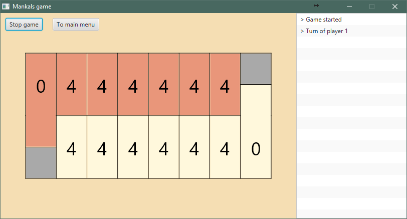
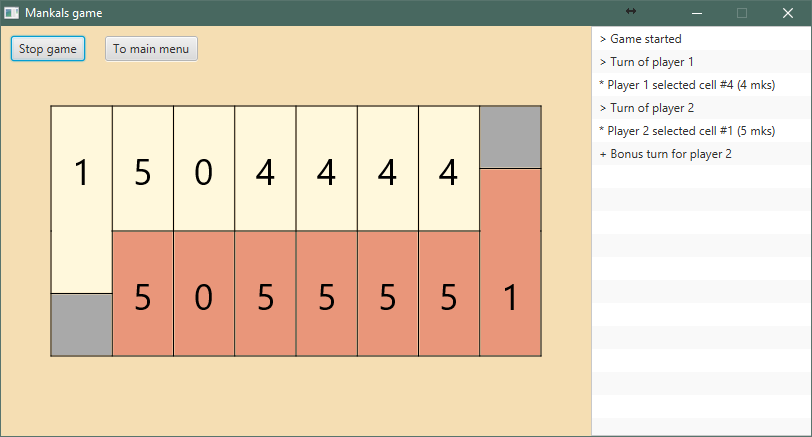
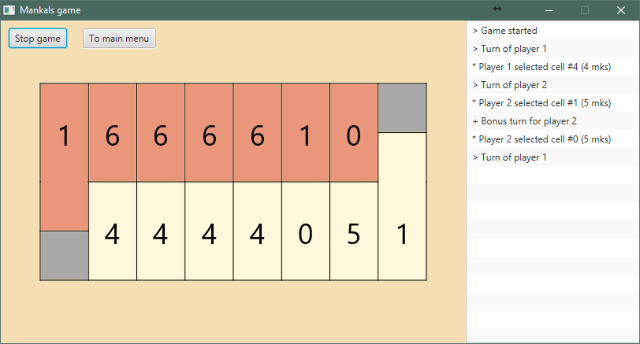
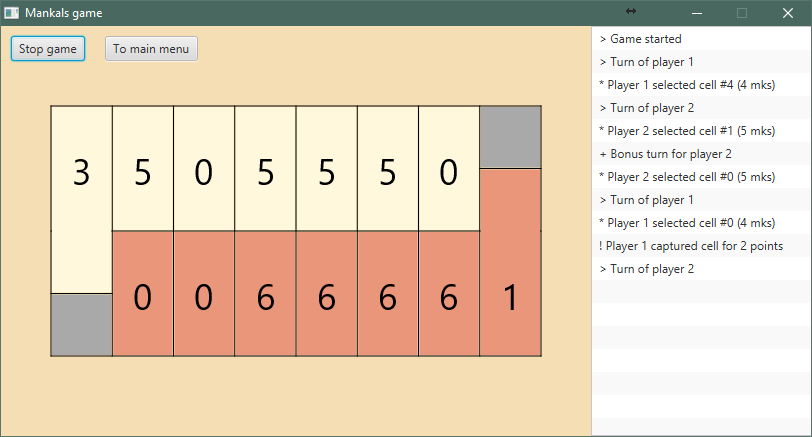
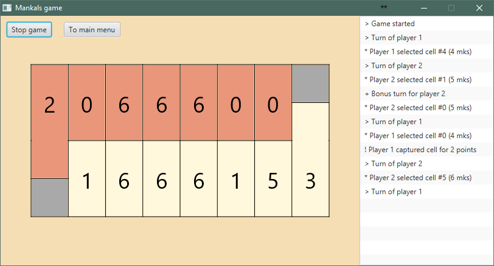
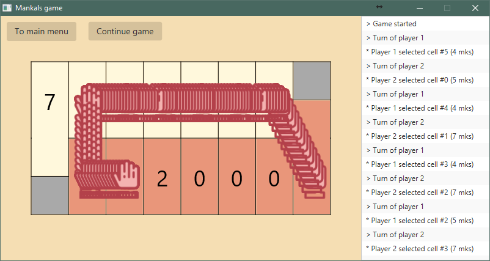

# Mankals game (Манкалы)

Classic board game with long history, now is implemented for PC

### Rules

Game consists of desk with cells. On each of players' sides there are 6 cells (named **player cells**) and two more special cells on the right and the left of the desk (named **base**).

Players play step-by-step. Each turn player can choose not-empty cell with rocks, takes them all and then put by one on the next cells. If player has no more his cells, he has to put one rock in his own base and continue put rest rocks to cells of his opponent. If opponent has no more his cells, then player skip opponent's base and do again by the new circle.

For better understanding let's see the example of game:

**1. Before the game**

This is game desk before the first turn

**2. After turn of 1st player**

First player selected his #4 cell with 4 rocks and decomposed them (1 in base and 2 in opponent's cells)

**3. Bonus turn for 2nd player**

If player finished to put rocks in his own base then he has one more turn

**4. After turn of 2nd player**

It's usual turn

**5. Capturing of 1st player**

If player finished decomposition on his cells (make full circle or not finished the first) that was empty and opponent's cell on other side not-empty, then player capture opponent's cell with all his rocks.

**6. Continue game till the end**

### Funny <s>bugs</s> features:

**1. Win98 style**

